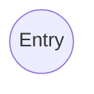

# this is the TEST

_Italic_ font _Italic_ is ok?

**bold** and **BOLD**
:smile:

# Heading

# Heading 1

## Heading 2

## Heading 2

[Link](this)

[link][1]

> Block quate
> block

- list
- list2
  - list
  - list
    - list
    - list

---

1. One
1. Two
1) One
2) Two
3) Three

---

:+1: :anger: :smile: :pen:

:angel: :thinking:

`Inline Code`

```cpp
#include <iostream>

int main() {
  std::cout << "Hello World" << std::endl;
}
```
heth

- [x] test

* [ ] test

｜ルビ《るび》
｜ル《・》｜び《・》

| TH  | TH               |
| --- | ---------------- |
| TD  | セル内で<br>改行|

| TH  |
| --- |
| TD  |

[link](#Heading)

[1]: http

<em>euahoetuh</em>


$$
\frac{a}{x} = \int^a_b f(x) dx

$$

# PluntUML

```plantuml Start
Alice -> Bob: Authentication Request
Bob --> Alice: Authentication Response

Alice -> Bob: Another authentication Request
Alice <-- Bob: another authentication Response
```




